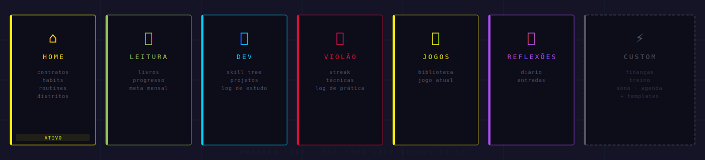

<p align="center">
  
</p>

<p align="center">
  <a href="https://victorg-glitch.github.io/notion/">
    
  </a>
  &nbsp;
  
  &nbsp;
  
  &nbsp;
  
</p>

<br>

```
╔══════════════════════════════════════════════════════════════════╗
║  ARASAKA LIFE OS  v2.077  //  INICIALIZANDO SISTEMA...           ║
║                                                                  ║
║  STATUS  ►  ONLINE                                               ║
║  STACK   ►  HTML · CSS · JS · SUPABASE                          ║
║  DEPLOY  ►  GITHUB PAGES                                         ║
║  HUD     ►  ARASAKA · NETRUNNER · MAELSTROM · CORPO             ║
╚══════════════════════════════════════════════════════════════════╝
```

---

## `//` BRIEFING

**Night City – Life System** é um painel pessoal de rotina com estética de HUD cyberpunk. Controla contratos diários, hábitos, leitura, dev, violão, jogos, reflexões e metas — tudo sincronizado em tempo real via Supabase.

Cada usuário cria sua conta com email e senha. Sessão persistente, dados isolados por perfil e modo **Commlink** para visualizar o progresso de um amigo em somente leitura.

---

## `//` MAPA DA CIDADE

<p align="center">
  
</p>

| Distrito | Rota | Intel |
|---|---|---|
| `⌂` **Home** | `home` | Painel diario com contratos, proximo alerta, semana, Intel e fechamento |
| `🔔` **Notificações** | `notificacoes` | Lembretes locais, Web Push, backup e diagnóstico do sistema |
| `📚` **Leitura** | `leitura` | Lista de livros, leitura atual e meta mensal |
| `💻` **Dev** | `dev` | Skill tree, projetos e log de estudo |
| `🎸` **Violão** | `violao` | Streak, técnicas e log de prática |
| `🎮` **Jogos** | `jogos` | Biblioteca e jogo em andamento |
| `🧠` **Reflexões** | `reflexoes` | Diário pessoal |
| `⚡` **Custom** | templates | Finanças, treino, sono, agenda e outros módulos guiados |

---

## `//` CHROME INSTALADO

```
[ CONTRATOS ]
  - Onboarding rapido com 3 perguntas: foco, estado da rotina e tempo diario
  - Templates genericos de primeiro uso para Saude, Estudos e Lazer
  - Botao MONTAR MINHA ROTINA cria contratos, lembretes, distritos, objetivo e primeira revisao
  - Setup nao finaliza sem pelo menos 1 contrato ativo
  - Templates prontos: Estudante, Programador iniciante, Academia e dieta, Organizar vida, Leitura e foco, Financas pessoais
  - Piloto automatico cria a base inicial e destaca o proximo passo do dia
  - Zero tela vazia: Home, livros, projetos e paginas custom exibem acoes guiadas
  - Estados vazios guiados em livros, projetos, jogos, logs, reflexoes, rotinas e contratos com CTA e template rapido
  - Novo fluxo `+ CONTRATO` com modo rapido por padrao e modo avancado opcional
  - Contratos podem ser editados, arrastados para reordenar, duplicados e arquivados sem apagar historico
  - Setup inicial guiado para nome/nick, objetivo, contratos, lembretes e distritos
  - Home reduzida para painel diario com botao de revisao
  - Fechamento do dia com energia, nota, pendencias e plano de amanha
  ▸ Contratos do dia editáveis com texto e tags personalizadas
  ▸ Habits Tracker semanal gerado automaticamente pelos contratos
  ▸ Painel de consistência com gráficos de semana, mês e streaks
  ▸ Auto-reset semanal com resumo da semana anterior

[ INTEL ATIVA ]
  - Street Cred e maior streak aparecem direto na Home
  - Toasts de recompensa ao concluir contratos e ao fechar o dia
  - Historico estruturado de evolucao para leitura, dev, violao, treino e revisoes
  ▸ Intel dinâmica: livro atual, projeto ativo, jogo e skill prioritária
  ▸ Rotinas customizáveis com passos detalhados
  ▸ Metas configuráveis por área

[ SISTEMA ]
  - Commlink como canal social secundario `CHAT`, separado do foco da rotina
  - Chat do Commlink com Supabase Realtime e polling leve como fallback
  ▸ Side Deck — menu lateral com módulos secundários
  ▸ Commlink — modo amigo somente leitura com sistema de permissões
  ▸ Busca global com filtros por distrito
  ▸ Templates guiados para criar novos distritos personalizados
  ▸ Modal cyberpunk de confirmação para ações destrutivas

[ NOTIFICAÇÕES ]
  - Diagnostico de permissao, service worker, push, ultimo teste e endpoint inscrito
  ▸ Alertas locais com barra visual cyberpunk
  ▸ Web Push com tela fechada via Supabase Edge Functions
  ▸ Fila de salvamento local com reenvio automático ao reconectar

[ VISUAL ]
  - Vocabulario muda por tema HUD em comandos centrais
  - Lore curto por distrito para reforcar a imersao
  ▸ 4 temas HUD: Arasaka · Netrunner · Maelstrom · Corpo
  ▸ Controle de movimento: Alta · Baixa · Desligada
  ▸ PWA instalável no celular e desktop
  ▸ Holo layer mobile + animações de boot e scan
```

---

## `//` PALETA NEON

<p align="center">
  
  &nbsp;
  
  &nbsp;
  
  &nbsp;
  
</p>

| Token | Hex | Facção | Uso |
|---|---|---|---|
| `--y` | `#fcee09` | **ARASAKA** | Foco, títulos e chamadas principais |
| `--c` | `#00d4ff` | **NETRUNNER** | HUD, links e notificações |
| `--r` | `#e00f3a` | **MAELSTROM** | Alertas, perigo e exclusão |
| `--p` | `#b44fff` | **CORPO** | Configurações, modais e reflexões |
| `--bg` | `#080810` | **NIGHT CITY** | Fundo do sistema |

---

## `//` CÓDIGO FONTE

| Arquivo | Função |
|---|---|
| `index.html` | Estrutura HTML e páginas |
| `style.css` | Visual, layout responsivo e animações |
| `app.js` | Lógica principal restante, renderização e estado global |
| `app-config.js` | Configuração, perfis e temas |
| `modules/state.js` | Chaves de salvamento, datas locais e normalizadores puros |
| `modules/security.js` | Escape de HTML, strings seguras e validações simples |
| `modules/auth.js` | Autenticação via Supabase Auth |
| `modules/ui.js` | Helpers visuais e estados vazios |
| `modules/migrations.js` | Versionamento de schema e normalizacao conservadora dos dados |
| `modules/routines.js` | Renderização e edição de rotinas |
| `modules/notifications.js` | Lembretes, diagnóstico e Web Push |
| `modules/storage.js` | Salvamento pendente, backup, exportação e importação |
| `modules/events.js` | Delegacao central de eventos para handlers estaticos do HTML |
| `sw.js` | Service Worker para PWA e Web Push |
| `scripts/check.cjs` | Checagem local de sintaxe, assets, seguranca e fluxos |
| `scripts/flow-check.cjs` | Checagem estatica dos fluxos principais |
| `scripts/migration-check.cjs` | Testes de migracao de schema e preservacao de campos |
| `manifest.webmanifest` | Manifesto PWA |

---

## `//` REDE DE NOTIFICAÇÕES

```
MODO 1 — SITE ABERTO
└── Notification API + barra visual cyberpunk interna

MODO 2 — TELA FECHADA  (Web Push)
└── Navegador → Push Subscription → Supabase
    └── Cron Job → Edge Function → Dispositivo
```

---

## `//` DEPLOY

O app é estático — GitHub Pages serve os arquivos diretamente. Nenhum build necessário.

```
git push origin main  →  site atualiza em ~1 min
```

---

## `//` ROADMAP

```
[ ] Migrar handlers inline → addEventListener (hardening CSP)
[ ] Extrair módulos restantes de app.js
[ ] Migrar handlers inline gerados por templates JS para remover `script-src 'unsafe-inline'`
[ ] Gráficos históricos mensais de consistência
[ ] Notificações por área com horário individual
```

---

<p align="center">
  
</p>
