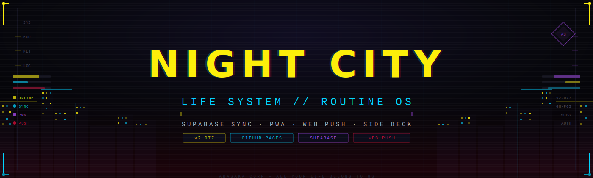

<p align="center">
  
</p>

# NIGHT CITY // LIFE SYSTEM

> Personal routine dashboard with a Cyberpunk HUD aesthetic, Supabase sync, PWA support, Side Deck modules and cross-device reminders.

<p>
  <a href="https://victorg-glitch.github.io/notion/"></a>
  
  
  <a href="#motion-policy"></a>
</p>

```txt
STATUS: ONLINE
PROFILE SLOTS: VICTOR / CAIO
STACK: HTML + CSS + JS + SUPABASE
DEPLOY: GITHUB PAGES
HUD: ARASAKA / NETRUNNER / MAELSTROM / CORPO
```

## Access Point

- Site: https://victorg-glitch.github.io/notion/
- Repository: https://github.com/Victorg-glitch/notion
- Main file: `index.html`
- Config file: `app-config.js`
- Service worker: `sw.js`
- Push backend: `supabase/functions/send-reminders/index.ts`

## System Briefing

`NIGHT CITY - LIFE SYSTEM` e um painel pessoal de rotina inspirado em interfaces cyberpunk. Ele organiza contratos diarios, habitos, leitura, estudos de dev, violao, jogos, reflexoes, treino, financas e metas pessoais.

| User | Role | Mode |
| --- | --- | --- |
| Victor | Netrunner | rotina principal |
| Caio | Corpo | rotina separada |

Cada perfil tem senha propria, sessao persistente e dados sincronizados no Supabase.

## Neon Palette

| Token | Color | Use |
| --- | --- | --- |
| `--y` | `#fcee09` | Arasaka, foco e chamadas principais |
| `--c` | `#00d4ff` | Netrunner, HUD e notificacoes |
| `--r` | `#e00f3a` | Maelstrom, alertas e perigo |
| `--p` | `#b44fff` | Corpo, configuracoes e modais |
| `--bg` | `#080810` | Fundo Night City |

## District Map

| District | Route | Payload |
| --- | --- | --- |
| Home | `home` | Contratos do dia, Intel e indicadores compactos |
| Notificacoes | `notificacoes` | Lembretes locais, Web Push, status e backup |
| Leitura | `leitura` | Livros, leitura atual e meta mensal |
| Dev | `dev` | Skill tree, projetos e log de estudo |
| Violao | `violao` | Streak, tecnicas e log de pratica |
| Jogos | `jogos` | Biblioteca e jogo atual |
| Reflexoes | `reflexoes` | Diario pessoal |
| Custom | templates | Financas, cartao, investimentos, compras, casa, agenda, comida, sono, metas, treino e cardio |

## Main Features

- Contratos do dia personalizaveis.
- Habits tracker automatico baseado nos contratos marcados.
- Painel de consistencia por semana e mes.
- Graficos historicos de consistencia por semana e progresso mensal por meta.
- Auto-reset semanal com resumo da semana anterior.
- Intel atual dinamica, puxando livro, projeto, jogo e skill prioritaria.
- Metas configuraveis para leitura, violao e fallbacks do Intel.
- `Side Deck` para modulos secundarios e central de configuracoes.
- Busca global por livros, projetos, jogos, reflexoes, logs e objetivos, com filtros por categoria.
- Modo amigo com pedido de permissao, resumo de permissoes e bloqueio de edicao.
- Modal proprio de confirmacao cyberpunk antes de excluir, resetar semana ou importar backup.
- Fila local de salvamento pendente quando o Supabase falha, com reenvio manual e tentativa automatica ao voltar online.
- Templates guiados para criar novos distritos.
- Controle de movimento: `Alta`, `Baixa` ou `Desligada`.
- Controles principais com foco visivel, contraste melhorado e botoes reais nas acoes de edicao.
- Backup completo ou seletivo por area, copia JSON e importacao pela aba `Notificacoes`.

## Code Organization

| File | Purpose |
| --- | --- |
| `app-config.js` | configuracao publica, perfis e temas |
| `modules/auth.js` | login Supabase Auth, migracao legado/Auth e sessao |
| `app.js` | logica principal do app, renderizacao, notificacoes e estado |
| `style.css` | visual, layout responsivo, acessibilidade e animacoes |
| `sw.js` | service worker para notificacoes e PWA |
| `scripts/check.cjs` | verificacao local de manutencao |
| `docs/night-city-banner.svg` | banner cyberpunk do README |
| `supabase/user-data-auth-hardening.sql` | SQL aplicado para RLS por usuario autenticado |

## Supabase Grid

```txt
Project URL: https://wmglywfsrlcpsspouufp.supabase.co
Main table: user_data(username, data_key, data_value, updated_at)
RLS: ativo em producao; apenas `authenticated` pode ler/escrever o proprio `username`
```

### Data Keys

| Key | Content |
| --- | --- |
| `pwd_hash` | Hash SHA-256 legado, usado apenas como ponte de migracao para Supabase Auth |
| `tasks` | Checks dos contratos por dia |
| `habits` | Historico semanal gerado pelos contratos |
| `taskDefs` | Contratos customizados |
| `habitDefs` | Habitos legados |
| `routines` | Rotinas customizadas |
| `skillDefs` | Skills de Dev |
| `guitarSkillDefs` | Tecnicas de Violao |
| `districts` | Distritos customizados |
| `books` | Livros |
| `projects` | Projetos |
| `devlog` | Log de estudo |
| `guitarlog` | Log de violao |
| `games` | Jogos |
| `reflexoes` | Diario/reflexoes |
| `skills` | Pontuacao de skills e tecnicas |
| `lastSeenWeek` | Ultima semana aberta |
| `goals` | Metas configuraveis |
| `reminders` | Configuracao dos lembretes |
| `customPages` | Conteudo das paginas custom dos distritos |
| `pageObjectives` | Objetivo principal por pagina/distrito |

## Notification System

### Local Alert

Funciona quando o site/app esta aberto ou em segundo plano permitido pelo navegador.

- Usa `Notification API`.
- Usa barra visual cyberpunk dentro do app.
- Possui teste pela aba `Notificacoes`.

### Closed-Screen Web Push

Funciona com o site fechado, desde que o aparelho permita Web Push.

```txt
Browser/PWA -> Push subscription -> Supabase table
Supabase Cron -> Edge Function -> Web Push provider -> Device notification
```

Arquivos envolvidos:

```txt
sw.js
manifest.webmanifest
supabase/push-notifications.sql
supabase/schedule-reminders.sql
supabase/functions/send-reminders/index.ts
```

## Security Notes

- A senha e hasheada com `crypto.subtle.digest('SHA-256')` e salt fixo `night_city_salt`.
- O login principal usa `Supabase Auth` com email/senha por conta individual.
- A tela inicial abre em modo `LOGIN`; a criacao fica em uma aba separada `CRIAR CONTA`.
- O formulario tem opcao de visualizar/ocultar senha e fluxo `ESQUECI A SENHA` com email de recuperacao do Supabase.
- A tela nao mostra mais Victor/Caio: cada pessoa informa nome, email e senha para entrar ou criar sua propria conta.
- O limite inicial client-side e de ate 5 contas conhecidas neste dispositivo (`ACCOUNT_LIMIT` em `app-config.js`).
- A criacao por email/senha envia `emailRedirectTo` para retornar ao proprio app depois da verificacao do email.
- Para a verificacao por email funcionar, adicione `https://victorg-glitch.github.io/notion/` nas URLs de redirecionamento permitidas do Supabase.
- As novas linhas em `user_data` usam `username = auth.uid()::text`; a politica `supabase/user-data-auth-uid.sql` mantem compatibilidade com os perfis antigos.
- A sessao persistente real passa a ser mantida pelo Supabase Auth; `localStorage` com `nc_session_v2` fica como fallback de compatibilidade.
- O app possui modo amigo somente leitura, com bloqueio de edicao, exclusao, checks, pontuacoes e salvamento.
- O arquivo `supabase/user-data-auth-hardening.sql` foi aplicado em producao e removeu as politicas publicas antigas de `user_data`.
- Cada usuario Auth acessa somente as linhas cujo `username` bate com o proprio `auth.uid()`.

## Visual System

- cards com bordas HUD;
- tabs com loading bar;
- icones SVG cyberpunk;
- mobile holo layer;
- feedback visual em toque/checks;
- foco visivel para teclado;
- botoes reais na navbar/topbar;
- temas baseados em variaveis CSS.

### Motion Policy

- `Alta`: ativa scans/glitches decorativos.
- `Baixa`: mantem movimento apenas em interacoes principais.
- `Desligada`: remove animacoes e transicoes.

## Maintenance Loop

Antes de subir mudancas:

```txt
node scripts/check.cjs
git diff --check
```

Validacao local:

```txt
python -m http.server 8765
```

Abra:

```txt
http://127.0.0.1:8765/
```

Os arquivos do app devem permanecer em UTF-8. Se acentos ou emojis aparecerem quebrados no terminal, valide no navegador antes de editar, porque PowerShell antigo pode renderizar UTF-8 incorretamente mesmo quando o arquivo esta correto.

## Deployment

GitHub Pages serve o app estatico:

```txt
index.html
app-config.js
app.js
style.css
sw.js
manifest.webmanifest
icon.svg
```

Supabase roda:

```txt
Edge Function: send-reminders
Cron: night-city-reminders-every-minute
```

## Roadmap

- Continuar extraindo modulos de `app.js` por area: notificacoes, distritos e paginas custom.
